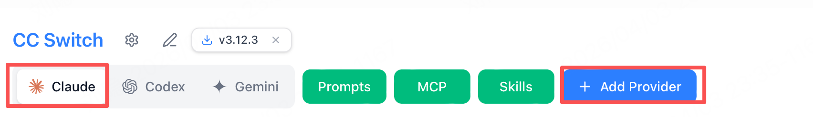
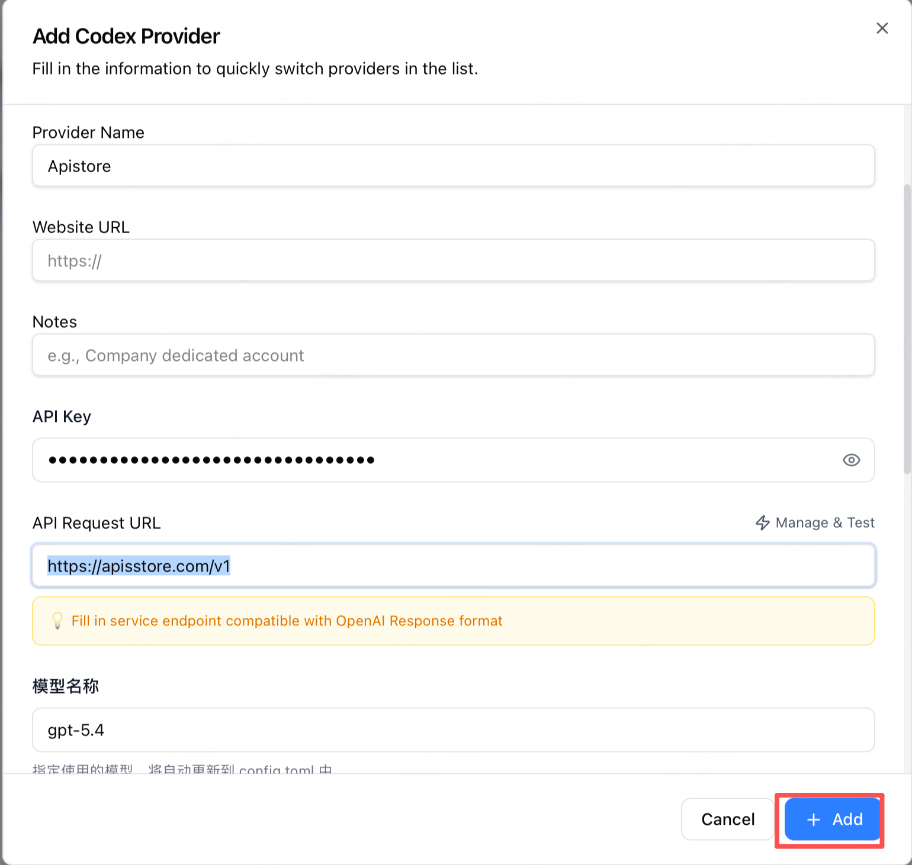
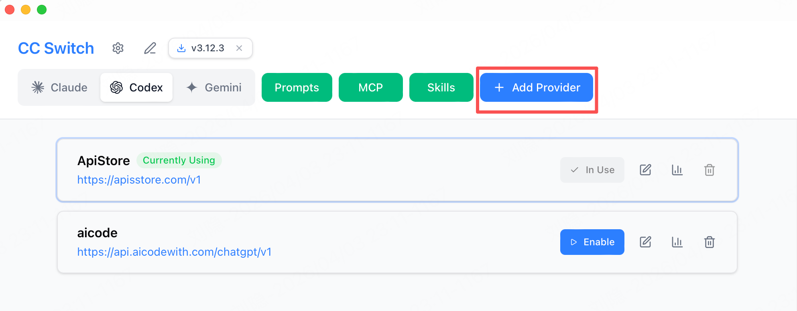
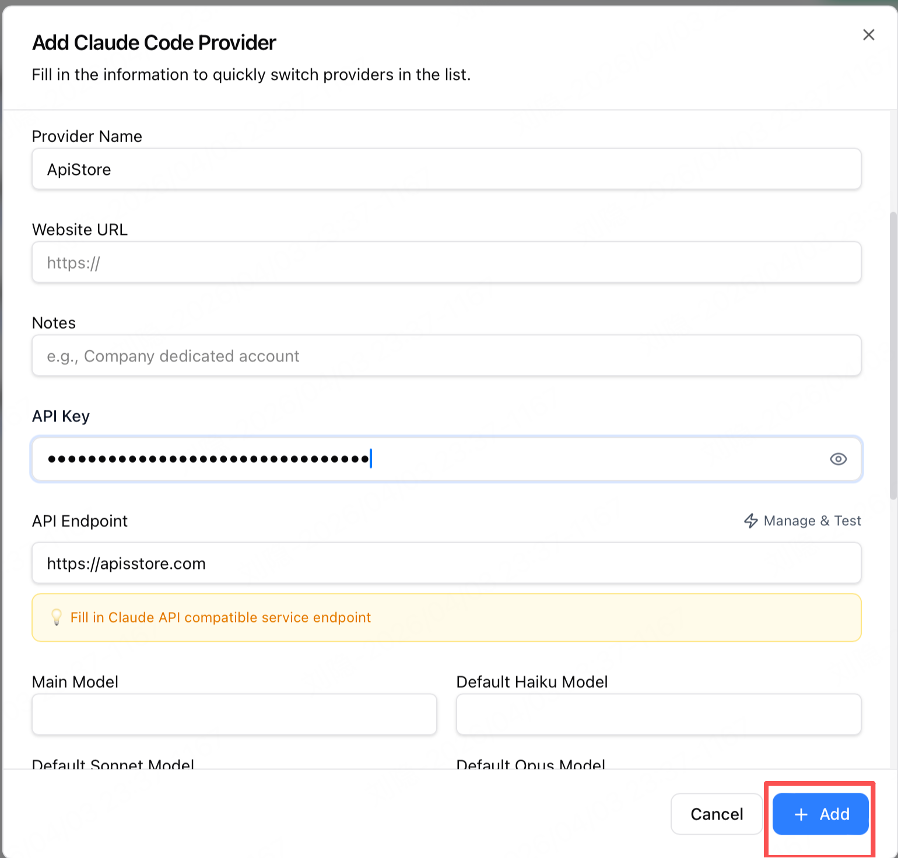

# 创建API KEY

## 注册账号
- 按钮注册,点击后跳转到https://apisstore.com/login
## 兑换码充值
- 切换到控制台
- 点击左侧导航栏的钱包管理
- 输入兑换码,点击兑换额度即可完成充值
- 如图
## 创建令牌
- 点击顶部控制台
- 点击左侧导航栏的令牌管理
- 点击添加令牌
- 如图所示

- 令牌名称：输入令牌的名称
- 令牌分组: default
- 点击提交,即可生成令牌
- 如图所示

- 创建完成后在列表可看到令牌,点击复制按钮即可复制令牌
- 
