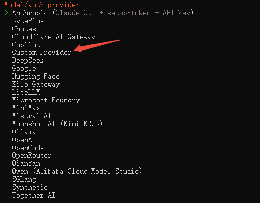

## 安装openclaw
- npm install -g openclaw
## 配置
- 安装完成后执行引导（根据提示完成基础设置）
- openclaw onboard --install-daemon
- 在模型提供商这里选择 Custom Provider
- 
- URL使用 https://apisstore.com/v1
- API KEY为创建的令牌key
- EndPoint-compatibility使用OpenAI-compatible
- Model ID为 gpt-5.4
- endpoint id 默认回车
- model alias 是可选，直接回车就可
